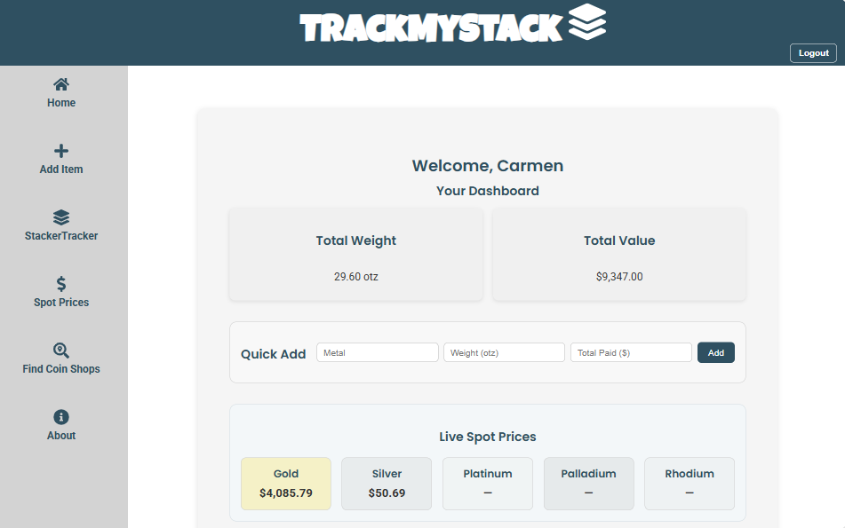
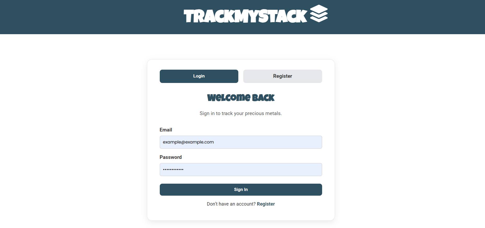
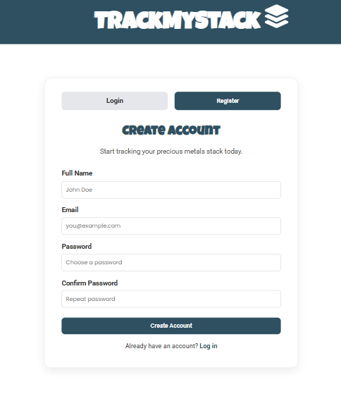
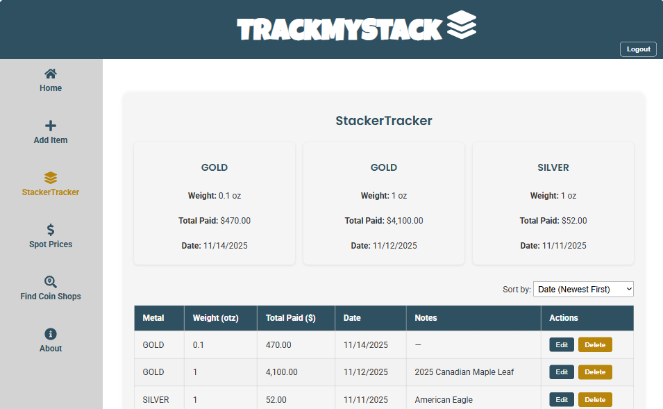
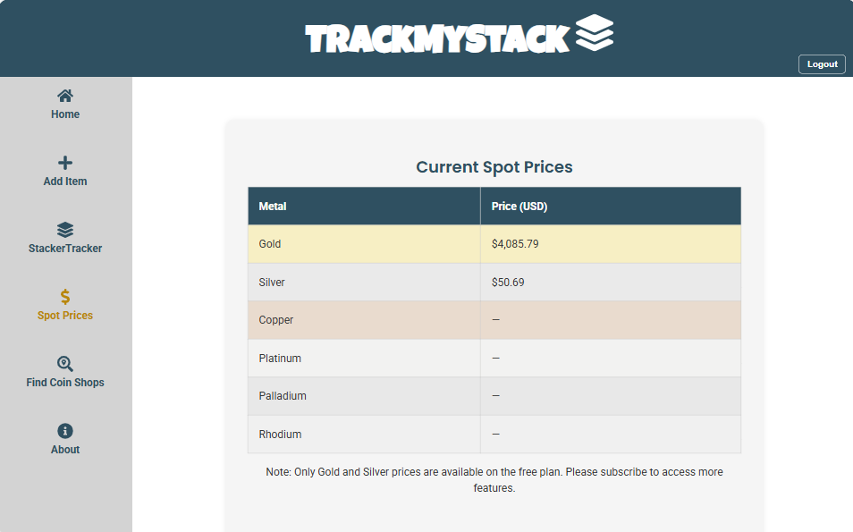
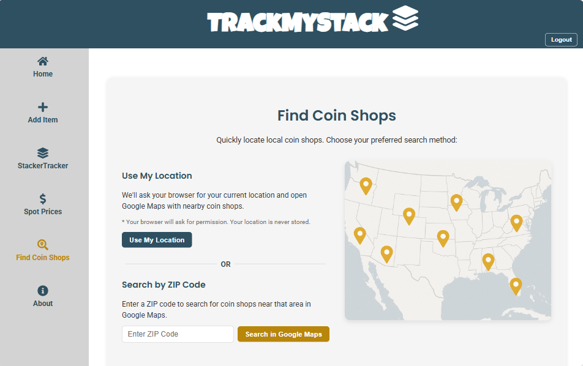

<div align="center">


# 🪙 **TrackMyStack**

A clean, modern, full-stack app that helps precious metal collectors stay organized, informed, and in control of their stack.

**Track smarter. Stack better. Stress less.**

---

### **Navigation**
[About](#-about-trackmystack) •
[Features](#-features-overview) •
[Visuals](#-preview-of-ui) •
[Tech](#-tech-stack) •
[Install](#-installation--setup) •
[Database](#️-database-structure) •
[Auth](#-authentication-jwt) •
[API](#-api-endpoints) •
[Future Features](#-future-features)

---
</div>

## 💡 About TrackMyStack

TrackMyStack is a clean, modern tool designed for precious metal collectors who want an easy way to track their stack without spreadsheets, scattered notes, or guesswork.
TrackMyStack gives collectors an all-in-one place to:

- View **live metal spot prices**  
- Track inventory with clean UI forms  
- Automatically calculate **total weight** and **total value**  
- Quickly locate nearby coin shops  
- Keep everything securely behind a JWT-protected login  

I built this project for my **LaunchCode Unit 2 Final**, combining frontend and backend skills into a full-stack application that actually solves a real problem collectors face. It blends full-stack concepts, API integration, responsive design, and clean usability.

---

## 🎛 Features Overview

### ✔ **Public Routes**
Only the following are accessible without authentication:

- `/login`
- `/register`

### ✔ **Authenticated Features**

Once logged in, users can:

- Add / edit / delete inventory items  
- View total stack weight & value  
- Use the Quick-Add feature  
- View the live spot price dashboard  
- Access the Find Coin Shops tool  
- Navigate personalized dashboard content  

### ✔ **Spot Price Dashboard (MetalpriceAPI)**

Live API-integrated pricing for:

- Gold  
- Silver  
- Copper  
- Platinum  
- Palladium  
- Rhodium  

Features:
- Color-coded tiles  
- Fallback handling (API limits, offline mode)  
- Cached DB entries for fast loading  

### ✔ **Find Coin Shops**

Two ways to search:

- **Use My Location**  
  Browser geolocation → opens Google Maps with nearby coin shops

- **Search by ZIP Code**  
  Uses **Zippopotam.us** to convert ZIP → lat/long → opens Google Maps centered on results  

---

## 🖼️ Wireframes

Figma Wireframes →  
https://www.figma.com/design/mBFVgFqOdGmqgUuUJlsgrz/TrackMyStack-Wireframe?node-id=0-1&t=kp5UXIKkzLANTS8V-1

---

## 📸 Preview of UI

<details open>
  <summary>🖥️ Dashboard</summary>
  
</details>

<details>
  <summary>➕ Add Item Form</summary>
  
</details>

<details>
  <summary>🔐 Login and Register</summary>
  
  
</details>

<details>
  <summary>📦 StackerTracker</summary>
  
</details>

<details>
  <summary>💲 Spot Prices</summary>
  
</details>

<details>
  <summary>🗺️ Find Coin Shops</summary>
  
</details>

---

## 🛠 Tech Stack

### **Frontend**


### **Backend**


### **External APIs**


---

## 🚀 Installation & Setup

### **Requirements**
- Node.js  
- npm  
- Java 21  
- Maven  
- MySQL 8+  

---

### Back End Setup (Java/Spring Boot/MySQL)

1.  **Clone the repository:** In the terminal, navigate to the directory where you want the project to live, then execute the following commands:
    ```shell
    git clone https://github.com/carmenrhodes/trackmystack-fullstack.git  # or your link, if forked
    cd trackmystack-fullstack/java-spring-boot-back-end-app/
    ```

2.  **Configure database:** Create a new MySQL database named `trackmystack_db`, then update the `src/main/resources/application.properties` file with your specific MySQL credentials: 
    ```properties
    spring.datasource.url=jdbc:mysql://localhost:3306/trackmystack_db
    spring.datasource.username=root
    spring.datasource.password=[your-password]
    ```

3.  **Run the Java/Spring Boot application:** If you do not have the application loaded in an IDE such as IntelliJ, go to the terminal and navigate to the root directory of the backend project. Then execute the following command to build and run the application (Hibernate will automatically create the tables): 
    ```shell
    mvn spring-boot:run
    ```

The API should now be running on `http://localhost:8080`

---

### Front End Setup (React/Vite)

1.  **Navigate to the front end project directory:** 
    ```shell
    cd ../react-front-end-app
    ```

2.  **Install dependencies:** 
    ```shell
    npm install
    # or 
    # yarn install
    ```

3.  **Run the React/Vite application:** 
    ```shell
    npm run dev
    ```

The frontend application will start and can be accessed at `http://localhost:5173`.

---

## 🗃️ Database Structure

### **ERD**
View the digital ERD here:  
👉 https://dbdiagram.io/d/TrackMyStack-ERD-68ed97642e68d21b41452b8e

TrackMyStack uses a MySQL relational schema consisting of:

- **user**  
  Stores registered users (email, password hash, full name, created timestamp).

- **user_stack**  
  Stores all inventory items associated with each user (metal, weight, quantity, total paid, etc.).

- **spot_prices**  
  Caches metal spot prices from MetalpriceAPI (price per otz and when it was retrieved).

- **stack_activity**  
  Stores buy/sell actions for a user’s stack (metal, type, quantity, unit price, fees, executed time).

### **Relationships**
- `user` **1 → many** `user_stack`  
- `user` **1 → many** `stack_activity`  
- `spot_prices` is independent (no foreign keys)

---

## 🔐 Authentication (JWT)

TrackMyStack uses a secure JWT-based authentication flow.

### **Flow**
- User registers — password hashed with **BCrypt**  
- User logs in — backend returns **JWT**  
- JWT stored in **localStorage**  
- All protected requests include:

  ```txt
  Authorization: Bearer <token>
  ```
  Spring Security + JJWT validate signature & expiration  
Logout removes the token client-side  

---

## ⚙ API Endpoints

### **Auth**
| Method | Endpoint              | Description               |
|--------|------------------------|---------------------------|
| POST   | `/api/auth/register`  | Create user account       |
| POST   | `/api/auth/login`     | Authenticate + return JWT |

### **Inventory**
| Method | Endpoint             | Description         |
|--------|-----------------------|---------------------|
| GET    | `/api/stack`         | Get all stack items |
| POST   | `/api/stack`         | Add item            |
| PUT    | `/api/stack/{id}`    | Update item         |
| DELETE | `/api/stack/{id}`    | Delete item         |

### **Spot Prices**
| Method | Endpoint       | Description                            |
|--------|----------------|----------------------------------------|
| GET    | `/api/prices` | Fetch cached or live MetalpriceAPI data |

---

## 🚧 Future Features

- Historical value charts  
- Profit/loss tracking  
- CSV / PDF export  
- Dark mode  
- Interactive map view  
- Shared family/household stacks  

---

## 👩🏽‍💻 Author

**Carmen Rhodes**  
[GitHub](https://github.com/carmenrhodes) •  [LinkedIn](https://linkedin.com/in/carmen-rhodes-a6652214a)

  

